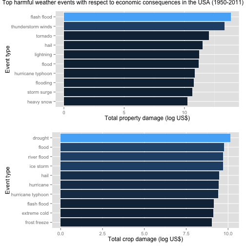

# Peer Assessment 2: Impact of severe weather events on public health and economy in the USA

# Synopsis

Storms and other severe weather events can cause both public health and economic problems for communities and municipalities. Many severe events can result in fatalities, injuries, and property damage, and preventing such outcomes to the extent possible is a key concern.

This project involves exploring the U.S. National Oceanic and Atmospheric Administration's (NOAA) storm database, whcih tracks characteristics of major storms and weather events in the United States, including when and where they occur, as well as estimates of any fatalities, injuries, and property damage. Analysis of the data shows that excessive heat and tornadoes cause the greatest harm to population health, while floods, droughts, and hurricanes/typhoons have the greatest economic consequences.

# Data Processing

## Raw data

The data for this assignment come in the form of a comma-separated-value file compressed via the bzip2 algorithm. The file can be downloaded by clicking [here] (https://d396qusza40orc.cloudfront.net/repdata%2Fdata%2FStormData.csv.bz2).
There is also some documentation of the database available to find how some of the variables are constructed/defined:
* [Storm Data Documentation] (https://d396qusza40orc.cloudfront.net/repdata%2Fpeer2_doc%2Fpd01016005curr.pdf) from the National Weather Service
* [FAQ] (https://d396qusza40orc.cloudfront.net/repdata%2Fpeer2_doc%2FNCDC%20Storm%20Events-FAQ%20Page.pdf) from the National Climatic Data Centre Storm Events


```r
fileurl = "https://d396qusza40orc.cloudfront.net/repdata%2Fdata%2FStormData.csv.bz2"
download.file(fileurl, "stormdata.csv.bz2", method="curl")
```

## Processing data

Read the data into a dataframe.


```r
stormdata = read.csv(bzfile("stormdata.csv.bz2"))
```

```
## Warning in open.connection(file, "rt"): cannot open bzip2-ed file
## 'stormdata.csv.bz2', probable reason 'No such file or directory'
```

```
## Error in open.connection(file, "rt"): cannot open the connection
```

Filter the dataset to keep only the variables relevant for our analysis, as well as remove rows that do not show meaningful data.


```r
names(stormdata)

## Extract relevant variables

newdata = stormdata[c(8,23:28)]
names(newdata)

## Remove rows that have 0 in the "Fatalities", "Injuries", "Propdmg" and "Cropdmg" variables

newdata = newdata[!(newdata$FATALITIES == 0 & newdata$INJURIES == 0 & newdata$PROPDMG == 0 & newdata$CROPDMG == 0), ]

## Clean up event types to better reflect unique events

newdata$EVTYPE = tolower(newdata$EVTYPE)
newdata$EVTYPE = gsub("[[:blank:][:punct:]+]"," ", newdata$EVTYPE)

## Calculate total property damage (as represented by the two variables `PROPDMG` and `PROPDMGEXP`) as well as total crop damage (as represented by the two variables `CROPDMG` and `CROPDMGEXP`)

EXPfunction = function(e) {
    # h = hundred, k = thousand, m = million, b = billion
    if (e %in% c('h', 'H'))
        return(2)
    else if (e %in% c('k', 'K'))
        return(3)
    else if (e %in% c('m', 'M'))
        return(6)
    else if (e %in% c('b', 'B'))
        return(9)
    else if (!is.na(as.numeric(e))) # if a digit
        return(as.numeric(e))
    else if (e %in% c('', '-', '?', '+'))
        return(0)
    else {
        stop("Invalid exponent value.")
    }
}

propdmgexp = sapply(newdata$PROPDMGEXP, FUN=EXPfunction)
newdata$PROPDMG = newdata$PROPDMG * (10 ** propdmgexp)
cropdmgexp = sapply(newdata$CROPDMGEXP, FUN=EXPfunction)
newdata$CROPDMG = newdata$CROPDMG * (10 ** cropdmgexp)
```

# Results

## Across the United States, which types of events are most harmful with respect to population health?

We identify the top ten event types that resulted in the most number of fatalities (as represented by the variable `Fatalities`), as well as those that caused the most number of injuries (as represented by the variable `Injuries`).


```r
library(plyr)
casualties = ddply(newdata, .(EVTYPE), summarize,
                  Fatalities = sum(FATALITIES),
                  Injuries = sum(INJURIES))
```

```
## Warning: closing unused connection 5 (stormdata.csv.bz2)
```

```r
fatality = head(casualties[order(casualties$Fatalities, decreasing = T), ], 10)
injury = head(casualties[order(casualties$Injuries, decreasing = T), ], 10)

fatality[, c("EVTYPE", "Fatalities")]
```

```
##             EVTYPE Fatalities
## 362        tornado       5633
## 54  excessive heat       1903
## 65     flash flood        978
## 130           heat        937
## 227      lightning        816
## 377      tstm wind        504
## 78           flood        470
## 269    rip current        368
## 174      high wind        248
## 11       avalanche        224
```

```r
injury[, c("EVTYPE", "Injuries")]
```

```
##                EVTYPE Injuries
## 362           tornado    91346
## 377         tstm wind     6957
## 78              flood     6789
## 54     excessive heat     6525
## 227         lightning     5230
## 130              heat     2100
## 211         ice storm     1975
## 65        flash flood     1777
## 321 thunderstorm wind     1488
## 113              hail     1361
```

```r
library(ggplot2)
library(gridExtra)

p1 = ggplot(data=fatality,
      aes(x=reorder(EVTYPE, Fatalities), y=Fatalities, fill=Fatalities)) +
      geom_bar(stat="identity") +
      coord_flip() +
      ylab("Total number of fatalities") +
      xlab("Event type") +
      theme(legend.position="none")

p2 = ggplot(data=injury,
      aes(x=reorder(EVTYPE, Injuries), y=Injuries, fill=Injuries)) +
      geom_bar(stat="identity") +
      coord_flip() + 
      ylab("Total number of injuries") +
      xlab("Event type") +
      theme(legend.position="none")

grid.arrange(p1, p2, main="Top harmful weather events with respect to population health in the USA (1950-2011)")
```

 

## Across the United States, which types of events have the greatest economic consequences?

We identify the top ten event types that resulted in the most property damage (as represented by the modified variable `PROPDMG`)  as well as those that caused the most crop damage (as represented by the modified variable `CROPDMG`) .


```r
ecoloss = ddply(newdata, .(EVTYPE), summarize,
                   Propdmg = sum(PROPDMG),
                   Cropdmg = sum(CROPDMG))
propdmg = head(ecoloss[order(ecoloss$Propdmg, decreasing = T), ], 10)
cropdmg = head(ecoloss[order(ecoloss$Cropdmg, decreasing = T), ], 10)

propdmg[, c("EVTYPE", "Propdmg")]
```

```
##                 EVTYPE      Propdmg
## 65         flash flood 6.820237e+13
## 338 thunderstorm winds 2.086532e+13
## 362            tornado 1.078951e+12
## 113               hail 3.157558e+11
## 227          lightning 1.729433e+11
## 78               flood 1.446577e+11
## 198  hurricane typhoon 6.930584e+10
## 85            flooding 5.920826e+10
## 309        storm surge 4.332354e+10
## 148         heavy snow 1.793259e+10
```

```r
cropdmg[, c("EVTYPE", "Cropdmg")]
```

```
##                EVTYPE     Cropdmg
## 43            drought 13972566000
## 78              flood  5661968450
## 273       river flood  5029459000
## 211         ice storm  5022113500
## 113              hail  3025974480
## 189         hurricane  2741910000
## 198 hurricane typhoon  2607872800
## 65        flash flood  1421317100
## 59       extreme cold  1312973000
## 99       frost freeze  1094186000
```

```r
e1 = ggplot(data=propdmg,
      aes(x=reorder(EVTYPE, Propdmg), y=log10(Propdmg), fill=Propdmg)) +
      geom_bar(stat="identity") +
      coord_flip() +
      ylab("Total property damage (log US$)") +
      xlab("Event type") +
      theme(legend.position="none")

e2 = ggplot(data=cropdmg,
      aes(x=reorder(EVTYPE, Cropdmg), y=log10(Cropdmg), fill=Cropdmg)) +
      geom_bar(stat="identity") +
      coord_flip() + 
      ylab("Total crop damage (log US$)") +
      xlab("Event type") +
      theme(legend.position="none")

grid.arrange(e1, e2, main = "Top harmful weather events with respect to economic consequences in the USA (1950-2011)" )
```

 
From the analysis above, 
